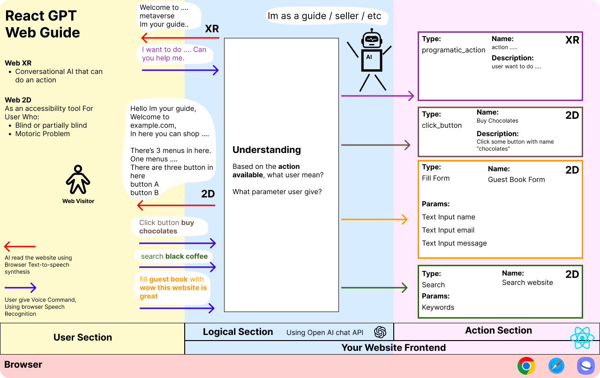

# React GPT Web Guide



**React GPT Web Guide** - Imagine you have an AI that can act as a guide on your website. It can be used as AI Web Accessibility, Web Metaverse NPC, Conversational AI, etc.

See the [demo](https://react-gpt-web-guide.vercel.app)

This is the Documentation for private repo [demo website](https://github.com/albirrkarim/demo-website-gpt-web-guide) and [npm package](https://github.com/albirrkarim/react-gpt-web-guide)

**Table Of Contents**

- [A. Introduction](#a-introduction)
- [B. Can be used as](#b-can-be-used-as)
- [C. How It Works](#c-how-it-works)
- [D. Todo](#d-todo)
- [E. API](#e-api)
- [F. Example Code](#f-example-code)
- [G. Changelog](#g-changelog)
- [H. Disclaimer](#h-disclaimer)
- [I. Warranty](#i-warranty)
- [J. Feedback](#j-warranty)
- [K. FAQ](#k-faq)

# Docs for v1.4.2

# A. Introduction

Recently, I worked on AI accessibility tools The idea is it's like conversational AI that can guide the user with a disability maybe a motoric, or visual problem and I also have an exhibition platform (Mozilla hubs based) that requires NPC that can act as a guide to my user.

Both using react JS for the implementation (UI) and for handling the complex logic, and unstructured data we need strong understanding capabilities which open AI chat completion API has.

Then I make this package in about 1 month.

What position is this package in your production apps?

Imagine the human body, They have a mouth (text-to-speech), ears (speech-to-text), a brain (chat GPT API), hands (programmatically calling function to do some action), eyes (the function that searches the web section, button, form, etc), but don't have foot because what the foot for haha.

So when you buy this package you get a new AI employee. (like human employees)

<br/>

# B. Can be used as

- Conversational AI
- Web Metaverse NPC
- AI Web Accessibility

<br/>

# C. How It Works

### The Interaction

Using [Browser SpeechSynthesis API](https://developer.mozilla.org/en-US/docs/Web/API/SpeechSynthesis) (text-to-speech) so the ai can speak and using [React Speech Recognition](https://github.com/JamesBrill/react-speech-recognition) for Speech Recognition (speech to text)

### As Web Accessibility Tools

Can be used as interactable web accessibility.

Screen Reader (all menus, buttons, form). Understand the user say and do the actions.

### As Metaverse NPC

You can set programatic action. so the package can integrate into your system.

```js
[
  {
    name: "Search",
    description: "Searching with some keyword",
    type: ACTION_TYPE.SEARCH,
    format: "search {keywords}",
    onAction: (params) => {
      console.log("Triggering onAction 2 with params: ");
      console.log(params);
      // params:
      //   {
      //     keywords: "elephant",
      //   }

      // this function will called if the user want to search something
    },
  },
];
```

<br/>

# D. Todo

- [ ] Let me know what you want from this package, please write it on issues tab
- [ ] Make Youtube Video
- [ ] Make API Metaverse NPC (0%)
- [ ] Example Code for Metaverse NPC (0%)
- [ ] Example Code for AI Web Accessibility (0%)
- [ ] Give source code comments (10%)
- [ ] API docs (0%)
- [ ] Automate the testing (Prompt Test, Unit Test)(2%)

<br/>
<br/>

# E. API

See [API.md](API.md)

<br/>

# F. Example Code

Contain simple example code, the full example code and implementation example using source code from demo website. the source code of demo website is included when you buy this package.

See [EXAMPLE_CODE.md](EXAMPLE_CODE.md)

<br/>

# G. Changelog

Changelog contains information about new feature, fix bug, and what you should do when the version is update.

See [CHANGELOG.md](CHANGELOG.md)

<br/>

# H. Disclaimer

There's no refund

<br>

# I. Warranty

I love feedback from my customers. You can write on the issue tab so when i have time i can try to solve that and deliver for the next update.

<br/>

# J. Feedback

Tell me what you think

Fill on the issue tab or Contact me:

Discord Username : albirrkarim

<br/>

# K. FAQ

<details>
  <summary>Why it's expensive?</summary>
  
<br/>

Try yourself to make this package. you will be grateful I am selling it cheap.

</details>

<br/>

<details>
  <summary>Why it's not opensource package?</summary>

<br/>

Well, i need money to funding the research, you know that making package is cost a lot of time and ofcourse money.

</details>

<br/>

<details>
  <summary>Is Chat GPT api sometime give wrong output?</summary>

<br/>

Yes, the ai not always 100% accurate, thats why i make prompt testing (which call real API not mocking) and unit test using [jest library](https://jestjs.io).

</details>

<br/>

<details>
  <summary>Voice Recognition is good enough?</summary>

<br/>

For now i use [react speech recognition](https://github.com/JamesBrill/react-speech-recognition) package. the accuracy and the supported device is also based on that package.

</details>

<br/>

<details>
  <summary>Is the open ai API cost expensive?</summary>

<br/>

I try to do efficiency for each prompt so the cost is minimum and keep accurate.

</details>

<br/>
<br/>

# Support me

<a href='https://ko-fi.com/Q5Q0BC92X' target='_blank'></a>

<a href="https://trakteer.id/albirrkarim" target="_blank"></a>
