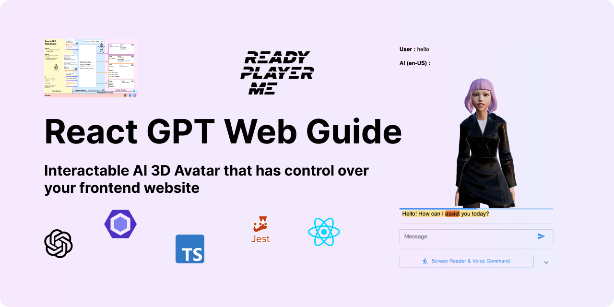
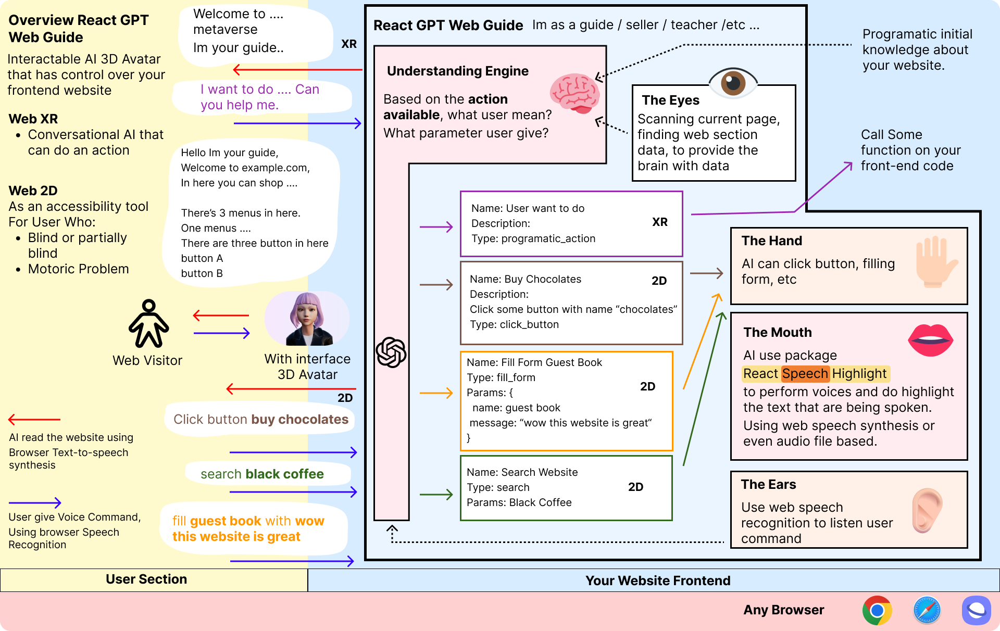

**React GPT Web Guide** - Interactable AI that have controll over your frontend website, It guides your user walk around your website its a salesman / supports.

[Try the demo React GPT Web Guide](https://react-gpt-web-guide.vercel.app)

Ask something? discord: albirrkarim

<br/>

## Features:

- All the feature that [React Speech Highlight](https://github.com/albirrkarim/react-speech-highlight-demo) have. This is the extended product of that package.
- Tested function and prompts using [jest](https://jestjs.io) and code linting using [eslint](https://eslint.org)
- Efficient [Chat GPT API cost](https://openai.com/pricing)
- Support [Typescript](https://www.typescriptlang.org), [Js Doc](https://jsdoc.app), [VS Code Intellisense](https://code.visualstudio.com/docs/editor/intellisense)
- Flexible package API.
- Less dependencies.

<br/>
<br/>

# Docs React GPT Web Guide v1.4.3

This is the Documentation for private repo [demo website](https://github.com/Web-XR-AI-lab/demo-website-gpt-web-guide)

**Table Of Contents**

- [A. Introduction](#a-introduction)
- [B. Todo](#b-todo)
- [C. API & Example Code](#c-api--example-code)
- [D. Changelog](#d-changelog)
- [E. Disclaimer & Warranty](#e-disclaimer--warranty)
- [F. FAQ](#f-faq)
- [G. Payment](#g-payment)

<br/>

## A. Introduction

### What i want?

**Disability**
Recently, I worked on AI accessibility tools The idea is it's like conversational AI that can guide the user with a disability maybe a motoric, or visual problem. So the tools must be able to read the page, understand the user's voice, and do some action programmatically.

Not just benfiting for the user with disability, but also for the normal user.

**Developer**
I hate to read long sofware documentation. i see screen every day my eyes was tired, so i hate read long text.
I want to make some AI for supporting user. like giving user code example. based on their knowledge.
I want make that ai is available in web front end. they can read current page, then do summarize, providing example code, or maybe ask something else that current page. Also the ai can click or interact on the page like human do.

**Guider**
I have website that have a lot of information, menus, page (Management System), how i can teach user to click this then click that for arriving to some destination feature or page that user looking for.

**Analogy**
Imagine you visit a cars showroom then the sales comes to you, you can ask them any thing, they also following your movement to look around. and they always ready to being asked for what you see.

Or maybe bring you to look around, in website context the AI know the link path where user can follow

**Displaying**
I want it to be more interactive, more fun, and more engaging. I want to make it like a 3D avatar that can control the website.

### Here what i got from the search on the internet:

**Accesibility tools**

There are many tools, mostly is subscription-based, and the price is expensive. I want to make it more affordable and more flexible. The practical solution one. Mostly just 2D interface, and doesn't have integrated with 3D Avatar. which enhance the user experience and make it more fun.

**Conversational AI 3D Avatar**

I found the [Talking Head](https://github.com/met4citizen/TalkingHead) project. its a js library that can make 3D avatar and do conversation with user with also lip sync and have animation. But they don't have the ability to control the website.

**3D AI avatar using React js**

Since my project using react js so it would be easier to me to use react js. I found project from [wawa sensei](https://github.com/wass08) about [Virtual Girlfriend](https://github.com/wass08/r3f-virtual-girlfriend-frontend) but again they don't have the ability to control the website and text highlight when the AI talk.

### Solutions

Making some frontend-package (npm package) that can doing various thing.

What position is this package in your production apps?

Imagine the human body, They have a mouth (text-to-speech), ears (speech-to-text), a brain (chat GPT API), hands (programmatically calling function to do some action), eyes (the function that searches the web section, button, form, etc).

### How It Works



#### The Interaction with user (Mouth and Ears)

Using [React / Vanilla Speech Highlight](https://github.com/albirrkarim/react-speech-highlight-demo) (text-to-speech with highlight) so the ai can speak and using [React Speech Recognition](https://github.com/JamesBrill/react-speech-recognition) for Speech Recognition (speech to text)

#### The Brain

I designing some engines that combine the LLM capabilities and efficient algorithm to save the cost. Featuring understanding user command with some initial knowledge (like what is your website about, etc).

#### The Hands

The hands is the function that can do some action programmatically. like search, click, etc.

#### The Eyes

The eyes is js function that can extract all section of your webpage that maybe inside it contain button, form, etc. then using LLM (Open AI API) make some literal text and after that the `Mouth` will speak it. (Human like informer)

#### The 3D Avatar

Using [React Three Drei](https://github.com/pmndrs/drei) and the [readyplayer.me](https://readyplayer.me/id) and mixamo for the avatar animation. Like in the wawa sensei project [virtual girlfriend](https://www.youtube.com/watch?v=EzzcEL_1o9o)

<br/>

### Use Cases

#### Conversational AI

Imagine the user can ask the AI about anything on your website. The AI can answer the user question, doing some action, etc.

#### As AI Web Accessibility Tools

Can be used as interactable web accessibility.

Screen Reader (all menus, buttons, form). Understand the user say and do the actions.

#### As Metaverse NPC

You can set programatic action. so the package can integrate into your system.

```js
[
  {
    name: "Search",
    description: "Searching with some keyword",
    type: ACTION_TYPE.SEARCH,
    format: "search {keywords}",
    onAction: (params) => {
      console.log("Triggering onAction 2 with params: ");
      console.log(params);
      // params:
      //   {
      //     keywords: "elephant",
      //   }

      // this function will called if the user want to search something
    },
  },
];
```

<br/>

## B. Todo

- [ ] Let me know what you want from this package, please write it on issues tab
- [ ] Make Youtube Video Tutorial
- [x] Typescript, Eslint
- [x] API docs, JS Doc
- [x] Automate the testing (Prompt Test, Unit Test)

<br/>
<br/>

## C. API & Example Code

See [API.md](API.md)

The full example code and implementation example using source code from demo website. the source code of demo website is included when you buy this package.

<br/>

# D. Changelog

Changelog contains information about new feature, fix bug, and what you should do when the version is update.

See [CHANGELOG.md](CHANGELOG.md)

<br/>

# E. Disclaimer & Warranty

There's no refund. I love feedback from my customers. You can write on the issue tab so when i have time i can try to solve that and deliver for the next update.

<br/>

<br/>

# F. FAQ

<details>
  <summary>Why it's expensive? Why it's not opensource package?</summary>
  
  <br/>

Try yourself to make this package. you will be grateful I am selling it cheap.

Well, i need money to funding the research, you know that making package is cost a lot of time and of course money.

</details>

<br/>

<details>
  <summary>Is Chat GPT api sometime give wrong output?</summary>

<br/>

Yes, the ai not always 100% accurate, thats why i make prompt testing (which call real API not mocking) and unit test using [jest library](https://jestjs.io).

</details>

<br/>

<details>
  <summary>Voice Recognition is good enough?</summary>

<br/>

For now i use [react speech recognition](https://github.com/JamesBrill/react-speech-recognition) package. the accuracy and the supported device is also based on that package.

</details>

<br/>

<details>
  <summary>Is the open ai API cost expensive?</summary>

<br/>

I try to do efficiency for each prompt so the cost is minimum and keep accurate.

</details>

<br/>

<details>
  <summary>How can I provide information for my chatbot?</summary>

<br/>

This package have something like initial knowledge. its some JSON that tell about:

`What is your website about?` -> so when the User ask the AI they can answer correctly.

</details>

<br/>

<details>
  <summary>Is it well documented and well crafted?</summary>
  
  <br/>

You can see the docs in this repo, and this package is written with typescript, and tested using jest to make sure the quality.

You don't have to read all the docs in here, because this package now support [VS Code IntelliSense](https://code.visualstudio.com/docs/editor/intellisense) what is that? simply its when you hover your mouse into some variable or function [VS Code](https://code.visualstudio.com/) will show some popup (simple tutorial) what is the function about, examples, params, etc...

Just use the source code from demo website, you can literally just understand the package.

</details>

<br/>
<br/>

## G. Payment

<br/>

The price is only $140 USD.

React GPT Web Guide ($100) + [React Speech Highlight](https://github.com/albirrkarim/react-speech-highlight-demo) (~~$94~~)($40) = $140

**What you got**

After you pay you will be invited inside my private repo and stay inside for 1 year to receive any updates.

- [The demo website (Next js based)](https://github.com/Web-XR-AI-lab/demo-website-gpt-web-guide)
- All the private repo web version of [React Speech Highlight](https://github.com/albirrkarim/react-speech-highlight-demo?tab=readme-ov-file#the-web-version-react-and-vanilla-js)

<br/>

### Payment method

I accept various payment method:

<a href="https://github.com/sponsors/albirrkarim" title="Github Sponsors">
    
</a>

<br/>
<br/>

# Keywords

So this package is the answer for you who looking for:

- Web Accessibility Tools
- web guide ai
- AI Web Accessibility
- react accessibility library
- Conversational AI for Websites
- 3d avatar that have control over website
- can ai controll over web
- Using AI to Enhance Web Accessibility
- Web Metaverse NPC
